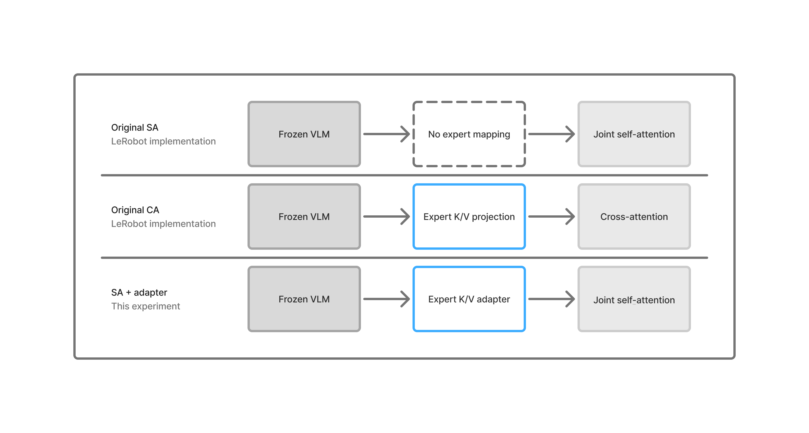

# SmolVLA self-attention K/V adaptation

A small study of the interface between frozen SmolVLM features and the SmolVLA action expert.

SmolVLA combines a frozen vision-language model with a trainable action expert. Its default expert alternates cross-attention and self-attention layers. The paper reports that this interleaved architecture reaches 85.5% success on LIBERO, compared with 79.0% for cross-attention alone and 74.5% for self-attention alone.

While examining the public LeRobot implementation, I found that the SA and CA variants differ in more than their attention pattern. In CA layers, frozen VLM keys and values pass through trainable projections owned by the action expert. In SA layers, the expert instead attends to prefix keys and values produced directly by the frozen VLM, with no equivalent expert-owned transformation.

This repository tests whether this asymmetric VLM-to-expert interface contributes to the poor SA result and reevaluates the interpretation of the attention layout ablation presented in the original paper. I added equivalent expert-owned prefix K/V projections to the SA layers and trained the original and modified architectures under the same conditions.

Across two training seeds, the adapter improved pure SA by 6.28 percentage points on average and by 16.20 points on LIBERO Long. SA+adapter finished one point behind the original interleaved model overall, while outperforming it on the Long tasks, making the architectural ranking much less conclusive.

## What is being compared

SmolVLA encodes the images, language instruction, and robot state as a prefix using the frozen SmolVLM, while the action expert processes a sequence of noisy action tokens. In a cross-attention layer, action queries attend only to the VLM prefix. Before that attention operation, the cached VLM keys and values pass through trainable 320 -> 320 projections owned by the action expert. In a self-attention layer, prefix and action K/V are combined in one causal attention operation, allowing action tokens to attend both to the prefix and to earlier action tokens. In this path, the prefix K/V are produced by the frozen VLM and enter the joint attention operation without an equivalent expert-owned transformation. The original SA and CA variants therefore change two things at once: the attention topology and the trainable interface between the frozen VLM prefix and the action expert. My ablation adds an analogous expert-owned prefix K/V transformation to SA layers (referred to below as the K/V adapter) while leaving action-token Q/K/V, attention masks, positions, cross-attention, and the training objective unchanged. I test this change in both pure SA and interleaved SA+CA models.

This distinction matters because the paper uses the SA, CA, and interleaved comparison to support the conclusion that the two attention mechanisms have complementary strengths. However, because the SA and CA variants also differ in their trainable interface to the frozen VLM prefix, that comparison does not isolate attention topology alone. The K/V adapter experiment tests how much of the reported SA performance gap can be removed when SA is given an analogous expert-owned transformation of the prefix K/V.

## Hypothesis

Going into this experiment I had two initial hypotheses about the ablation effect on the model performance.

The first hypothesis was that SA is disadvantaged by receiving prefix K/V directly from the frozen VLM, without the expert-owned transformation available in the CA path. Adding an analogous trainable transformation should therefore improve SA.

The second was that removing this asymmetry might allow an all-SA expert to match the interleaved architecture. Joint self-attention can in principle learn both prefix conditioning and action-token interaction without assigning fixed roles to different layers.

## Experiment

Before training, I checked the new path with the K/V adapter initialized to identity. The adapted and original models used identical shared weights, the same fixed LIBERO batch, and the same flow-matching noise and time samples. Their losses agreed within `rtol=1e-3` and `atol=1e-4`. A backward pass also confirmed finite, nonzero adapter gradients. Identity initialization was used only for this check. The adapters used the standard model initialization in every training run.

I compared five model variants:

| Variant | Attention layout | K/V adapter |
| --- | --- | --- |
| CA | Cross-attention only | No |
| SA | Self-attention only | No |
| SA + adapter | Self-attention only | Yes |
| SA+CA | Interleaved | No |
| SA+CA + adapter | Interleaved | Yes |

Each variant was trained with seeds `0` and `1` for 100,000 steps at batch size 64. Training used a frozen SmolVLM backbone and a trainable action expert on [`lerobot/libero`](https://huggingface.co/datasets/lerobot/libero) at revision `a1aaacb7f6cd6ee5fb43120f673cebb0cfea7dd4`. The recipe follows the [SmolVLA simulation setup](https://arxiv.org/html/2506.01844) and the additional [reproduction settings discussed by the LeRobot community](https://github.com/huggingface/lerobot/issues/3287#issuecomment-5076885804).

Every checkpoint was evaluated on all 40 LIBERO tasks using evaluation seed `1000`, with 50 episodes per task and 2,000 episodes in total. Flow matching used 10 denoising steps. The policy executed 10 actions from each predicted chunk before taking a new observation. This reduces evaluation time and was the best-performing setting in the paper’s action-execution ablation. It differs from the paper’s main simulation protocol, which took a new observation after every action.

For the two leading variants, I repeated the complete 2,000-episode evaluation with seed `2000` for both training seeds. This checks whether their ranking depends on a particular set of evaluation conditions.

The repository includes the [Slurm scripts](scripts), [saved training configurations](results/train_configs), and [raw evaluation results](results/evaluations).

## Results

### Reproducing the original ranking

Before examining the K/V adapter, I compared the three unmodified architectures with [Table 6 of the SmolVLA paper](https://arxiv.org/html/2506.01844). Our values are averages over training seeds `0` and `1`, with 2,000 evaluation episodes per checkpoint.

| Architecture | Source | Spatial | Object | Goal | Long | Average |
| --- | --- | ---: | ---: | ---: | ---: | ---: |
| CA | Paper | 87.0 | 92.0 | 83.0 | 54.0 | 79.00 |
| CA | Ours | 81.8 | 88.6 | 87.8 | 69.0 | 81.80 |
| SA | Paper | 80.0 | 94.0 | 84.0 | 40.0 | 74.50 |
| SA | Ours | 79.8 | 86.7 | 88.4 | 56.5 | 77.85 |
| SA+CA | Paper | 86.0 | 99.0 | 90.0 | 67.0 | 85.50 |
| SA+CA | Ours | 86.5 | 93.5 | 90.4 | 70.1 | 85.13 |

The original ranking was preserved independently in both training runs. Seed `0` produced SA+CA at 84.45%, CA at 82.60%, and SA at 76.70%. Seed `1` produced SA+CA at 85.80%, CA at 81.00%, and SA at 79.00%.

The margins differ from the paper, but both seeds reproduce its main result: interleaving SA and CA performs best, CA comes second, and pure SA performs worst. The two-seed interleaved average of 85.13% is also within 0.38 points of the reported 85.5%.

This is a close qualitative reproduction rather than an exact numerical one. Our evaluation uses 50 instead of 10 episodes per task and executes 10 actions before updating the observation. The largest numerical difference appears on LIBERO Long. What matters for the ablation is that the relevant architectural ordering is recovered before introducing the K/V adapter.

### Effect of the K/V adapter

The table below reports success rate in percent for evaluation seed `1000`, averaged over training seeds `0` and `1`. Each suite contains 10 tasks with 50 episodes per task, so every suite value averages 1,000 episodes across the two checkpoints. `Average` covers all 40 tasks and 4,000 episodes. Because the suites are equal in size, it is also the equally weighted mean of the four suite rates. Long denotes the 10 LIBERO-10 tasks.

| Architecture | Spatial | Object | Goal | Long | Average |
| --- | ---: | ---: | ---: | ---: | ---: |
| CA | 81.8 | 88.6 | 87.8 | 69.0 | 81.80 |
| SA | 79.8 | 86.7 | 88.4 | 56.5 | 77.85 |
| SA + adapter | 83.1 | 89.2 | **91.5** | **72.7** | 84.13 |
| SA+CA | **86.5** | **93.5** | 90.4 | 70.1 | **85.13** |
| SA+CA + adapter | 85.6 | 89.3 | 89.7 | 70.9 | 83.88 |

Adding the adapter reduced the 7.28-point gap between the original SA and interleaved models to 1.00 point, corresponding to a 6.28-point improvement in SA from 77.85% to 84.13%. The gain was present in both training runs: +6.20 points for seed `0` and +6.35 for seed `1`. It also placed SA + adapter 2.33 points above CA. The remaining difference was suite-dependent: SA + adapter lagged SA+CA by 3.40 points on Spatial and 4.30 on Object, but led it by 1.10 on Goal and 2.60 on Long.

Adding the adapter to the interleaved model did not improve it. SA+CA + adapter fell by 1.25 points overall, including a 4.20-point regression on Object. One possible explanation is that the CA layers already provide an expert-owned transformation of the prefix K/V, reducing the benefit of adding the same capability to the SA layers. Another is that the additional transformations alter optimization in a way that is unfavorable in the interleaved model. These explanations are not distinguished by the present experiment.

### Unexpected performance on Long tasks

Long performance was not the target of this study, but it produced the most consistent result. Each entry below is the success rate over 500 Long episodes for one checkpoint. The mean therefore covers 1,000 episodes.

| Architecture | Training seed 0 | Training seed 1 | Mean |
| --- | ---: | ---: | ---: |
| CA | 69.2 | 68.8 | 69.0 |
| SA | 54.8 | 58.2 | 56.5 |
| **SA + adapter** | **71.6** | **73.8** | **72.7** |
| SA+CA | 68.8 | 71.4 | 70.1 |
| SA+CA + adapter | 71.4 | 70.4 | 70.9 |

SA + adapter was the best Long variant for both training seeds. It led the next-best model by 0.2 points for seed `0` and by 2.4 points for seed `1`. Its 16.20-point improvement over original SA was also much larger than its gains on Spatial, Object, or Goal.

One possible interpretation is that longer tasks depend more heavily on making the VLM context useful to the action expert throughout the trajectory. Joint self-attention may benefit from that context once the prefix has an expert-owned adapter. This experiment does not directly test that mechanism, so it should be treated as a hypothesis raised by the result.

The consistency of the Long result suggests that pure SA + adapter should not be discarded in future comparisons, even though the original interleaved model remains slightly stronger overall.

### Robustness to evaluation seed

The two leading models were evaluated again with evaluation seed `2000`. Each `Overall` value below covers all 40 tasks and 2,000 episodes; each `Long` value covers 10 tasks and 500 episodes. The mean row averages four evaluations per model: 8,000 overall episodes and 2,000 Long episodes.

| Training seed | Evaluation seed | SA + adapter Overall | SA+CA Overall | SA + adapter Long | SA+CA Long |
| ---: | ---: | ---: | ---: | ---: | ---: |
| 0 | 1000 | 82.90 | 84.45 | **71.6** | 68.8 |
| 0 | 2000 | 83.60 | 84.55 | **72.2** | 68.6 |
| 1 | 1000 | 85.35 | 85.80 | **73.8** | 71.4 |
| 1 | 2000 | **85.50** | 85.10 | **73.8** | 70.6 |
| Mean | — | 84.34 | **84.98** | **72.85** | 69.85 |

The evaluation seed changed any checkpoint’s overall result by at most 0.70 points. SA+CA ranked first overall in three comparisons, while SA + adapter ranked first once. Across all four evaluations, SA+CA retained a small 0.64-point overall advantage.

The suite pattern also remained similar. SA + adapter averaged 2.70 points below SA+CA on Spatial and 3.65 below on Object. It averaged 0.80 points above it on Goal and 3.00 above on Long. In contrast to the close overall ranking, SA + adapter won all four matched Long comparisons.

## Conclusion

The original interleaved architecture remains the safest default. It has the highest overall mean and a consistent advantage on Spatial and Object.

However, pure SA moved from last place at 77.85% to competing for first at 84.13% after adding the K/V adapter. It surpassed CA overall and outperformed SA+CA on Goal and Long, while remaining only one point behind it overall.

The adapter removed 6.28 of the original 7.28-point gap between SA and SA+CA, or roughly 86%. Under this setup, the poor SA result therefore cannot be attributed to attention topology alone. Most of the gap disappears once SA is given an analogous trainable prefix K/V projection.

This does not show that the interface uniquely explains that recovery. The adapter also changes the SA parameterization and potentially its optimization. A complementary experiment that removes or freezes the CA-side K/V projections would help separate these effects more cleanly.

The Long result makes the adapted SA variant especially worth following up. It was the best Long model for both training seeds and remained ahead in every repeated evaluation. More seeds and other long-horizon benchmarks are needed to determine whether this is a general advantage.

## Repeatability

The implementation targets LeRobot commit `713a409faedd73bb5597481b8885f17fbee23330`. The adapter implementation and parity test are provided in [`patches`](patches).

The exact training and evaluation commands are recorded in [`scripts`](scripts), while the saved training configurations are available in [`results/train_configs`](results/train_configs). Raw evaluation files are stored in [`results/evaluations`](results/evaluations).

Each evaluation JSON contains outcomes for all 40 tasks, with 50 episodes per task, together with per-suite and overall aggregates. The tables above can therefore be recomputed directly from the checked-in episode-level results.
