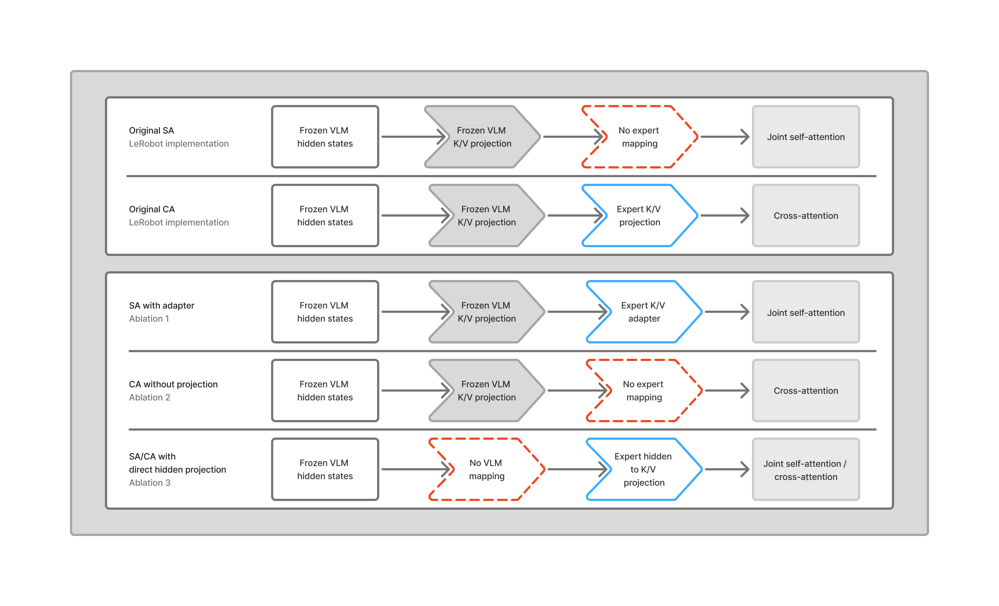

# SmolVLA VLM-to-expert interface ablations

A study of the interface between frozen SmolVLM features and the SmolVLA action expert.

SmolVLA combines a frozen vision-language model with a trainable action expert. Its default expert alternates cross-attention and self-attention layers. The paper reports that this interleaved architecture reaches 85.5% success on LIBERO, compared with 79.0% for cross-attention alone and 74.5% for self-attention alone.

While examining the public LeRobot implementation, I found that the SA and CA variants differ in more than their attention pattern. In CA layers, frozen VLM keys and values pass through trainable projections owned by the action expert. In SA layers, the expert instead attends to prefix keys and values produced directly by the frozen VLM, with no equivalent expert-owned transformation.

This repository tests whether this asymmetric VLM-to-expert interface explains the poor SA result and reevaluates the interpretation of the attention layout ablation presented in the original paper. It also tests an alternative interface in which expert-owned projections produce prefix K/V directly from the VLM hidden states.

Detailed reports are available for [K/V adaptation in self-attention and cross-attention](kv_adapter.md) and [direct projection from VLM hidden states](hidden_kv_projection.md).

## Main findings

Adding a trainable K/V projection moved pure SA from last place to close competition with SA+CA. Removing the corresponding projection from CA reduced its performance to approximately the original SA level. Both effects were strongest on Long tasks and confirm that the asymmetric prefix interface, rather than SA topology alone, explains the poor relative performance of the pure SA model.

Projecting the action expert’s prefix K/V directly from the VLM hidden states resulted in worse overall performance with particularly large losses on Long tasks.

Together, the results point to the importance of retaining the pretrained VLM K/V representation and adapting it for the action expert. In these experiments, this choice of the VLM-to-expert interface had a greater effect on performance than the choice of attention mechanism when compared with the same type of prefix interface.

# K/V adaptation in SA and CA

I first reproduced the paper’s architectural performance ordering, then added an analogous expert-owned K/V projection to SA. To test whether the same interface matters for CA, I removed its existing projection while keeping its attention layout unchanged.

The table below reports success rate in percent, averaged over two training seeds evaluated with the same evaluation seed. Each checkpoint was evaluated on 40 LIBERO tasks with 50 episodes per task. Long covers the 10 LIBERO-10 tasks.

| Architecture | Prefix K/V interface | Long | Average |
| --- | --- | ---: | ---: |
| SA | Frozen VLM K/V directly | 56.5 | 77.85 |
| SA + adapter | Trainable projection of VLM K/V | **72.7** | 84.13 |
| CA without projection | Frozen VLM K/V directly | 57.2 | 77.13 |
| CA | Trainable projection of VLM K/V | 69.0 | 81.80 |
| SA+CA | Original interleaved interface | 70.1 | **85.13** |
| SA+CA + adapter | Trainable projection of VLM K/V (for SA and CA) | 70.9 | 83.88 |

The adapter moved SA to second overall, one percentage point behind SA+CA, and made it the strongest Long variant. Removing the CA projection produced the opposite effect, bringing CA close to the original unadapted SA result.

Adding the SA adapter to the SA+CA model reduced overall performance. Unlike pure SA, the interleaved model already contains an expert-owned prefix transformation in every CA layer, reducing the benefit of adding the same capability to its SA layers.

I also repeated the evaluation of SA + adapter and SA+CA with a second evaluation seed for both training seeds. SA+CA won three of the four matched comparisons overall, while SA + adapter won all four comparisons on the Long tasks.

The full results are described in [K/V adaptation in self-attention and cross-attention](kv_adapter.md).

# Direct projection from VLM hidden states

The adapter results raised a further question: would the expert benefit from accessing the full VLM hidden states before they are compressed into keys and values?

The final ablation replaced the expert’s projections of frozen VLM K/V with projections directly from those hidden states. In pure SA, this change applies to every expert layer. In SA+CA, it applies only to the CA layers.

Bypassing the frozen K/V projections introduced two choices. For positional encoding, I compared assigning position zero to all newly projected prefix keys with retaining individual token positions through RoPE. The shared-position variant was motivated by the visual tokens describing the same observation time, while action tokens describe a future sequence. For initialization, I compared random weights with copies of the VLM’s already learned K/V projection weights.

The table below reports average success in percent across all 40 tasks, with 50 episodes per task, for these direct projection variants. This experiment used one training seed and a shared evaluation seed. Each row differs only in the positional encoding and initialization used by the new prefix projections.

| Prefix positions | Initialization | SA | SA+CA |
| --- | --- | ---: | ---: |
| All zero | Random | 76.75 | 77.45 |
| All zero | VLM | 77.85 | 77.20 |
| Individual RoPE positions | Random | 79.50 | **81.50** |
| Individual RoPE positions | VLM | **81.25** | 78.20 |

Individual prefix positions improved overall success in every matched comparison. VLM initialization helped SA but did not help SA+CA.

Even the best direct projection configurations remained below the earlier interfaces at the same training and evaluation seeds. SA + adapter reached 82.90% compared with 81.25% for direct projection. The original interleaved model reached 84.45% compared with 81.50%.

The full comparison is described in [Direct projection from VLM hidden states](hidden_kv_projection.md).

## Conclusion

The reciprocal ablations show that the original SA disadvantage was largely caused by the asymmetric prefix K/V interface rather than the SA attention topology. Most of the disadvantage disappears after adding a trainable K/V adapter, while CA falls to approximately the original SA level when its corresponding projection is removed.

Under this setup, the strongest results retain the pretrained VLM K/V representation and adapt it for the expert. Direct hidden-state projection did not improve on that interface, suggesting that the K/V bottleneck is useful rather than simply a restriction on information.

The original interleaved model remains the safest default overall. Pure SA + adapter is a competitive alternative with consistently stronger Long performance. The hidden-state experiment is more exploratory because it uses one training seed and also changes positional handling.

The patches, training configurations, scripts and raw results are available under [SA K/V adaptation](ablation_1_kv_adapter_self), [CA without K/V projection](ablation_2_no_kv_proj_cross) and [direct hidden-state projection](ablation_3_hidden_kv_proj).
